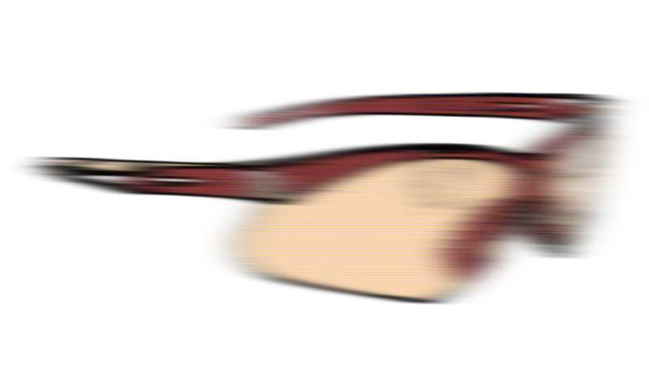

# Mojave

[Shapeless](https://github.com/milessabin/shapeless) lenses for the brave. Boilerplate-light partially type-unsafe optics for those who know what they're doing.

## Type-unsafe lenses

Mojave takes [Shapeless](https://github.com/milessabin/shapeless) lenses and adds a type-unsafe way for accessing
case class fields. This is useful in cases where you have a polymorphic data model where you have multiple case classes
implementing the same trait.

```scala
  import mojave._

  trait Tag
  case class Html(content: Tag)
  case class Body(content: String) extends Tag
  case class Head(content: String) extends Tag

  private val wrapper = Html(Body("hello world"))

  private val compositeLens: Lens[Html, Option[String]] = (lens[Html])
    .field[Tag]("content")
    .ifInstanceOf[Body]
    .optField[String]("content")

  println(compositeLens.set(wrapper)(Some("hallo welt")))
```

## Traversals

In addition, Mojave introduces `Traversals` that allow you to focus on multiple items (whereas lenses always focus on a single item).
With traversals you can change multiple items within an arbitrary data structure.

```scala
  import mojave._
  import Examples._

  private val wrapper = Zoo(List(Giraffe("giraffe", 1), Pony("pony", 2), Insect()), 0)

  private val compositeLens: Traversal[Zoo, String] = (traversal[Zoo])
    .field[List[Animal]]("animals")
    .items
    .ifInstanceOf[AnimalWithName]
    .field[String]("name")

  println(compositeLens.modify(wrapper)(x => "great " + x))
```